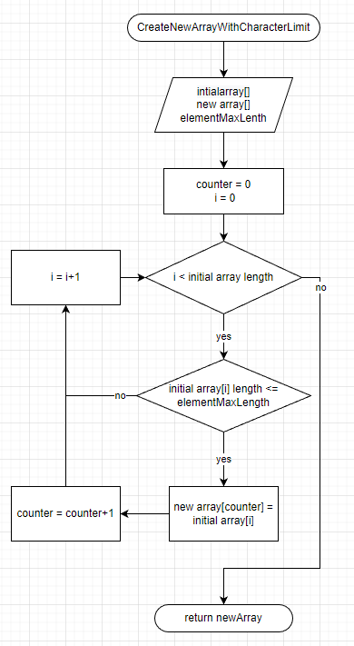

# ***Итоговая проверочная робота***

## Описание решения

1. Первоначальный массив заполняется с помощью метода ***FillStringArray***.
2. Заводиться переменная ***elementMaxLength*** для хранения значения максимальной длины элемента массива. (по условию задачи 3)
3. Заводится новый массив, размер которого определяется методом ***GetArrayLength***.
4. Новый массив заполняется методом ***CreateNewArrayWithCharacterLimit***.
5. Оба массива выводятся в терминал  методом ***PrintArray***.

## Описание метода  CreateNewArrayWithCharacterLimit

В метод передаются:
* Первоначальный массив
* Новый массив 
* Максимальная длина элемента

1. Заводятся инкременты  ***counter*** и ***i*** со значением 0
2. Цикл который действет пока ***i*** меньше длинны первоначального массива.
3. внутри цикла производится ветвление с условием (длина элемента под номером ***i*** меньше или равно масимальной длине элемента). если условие выполняется, то элементу первоначального массива под номером ***counter*** присваевается элемент первоначального массива под номером ***i***. ***counter*** и ***i*** евеличиваются на 1.
если условие не выполняется то ***i*** евеличиваются на 1.
4. возвращается новый массив